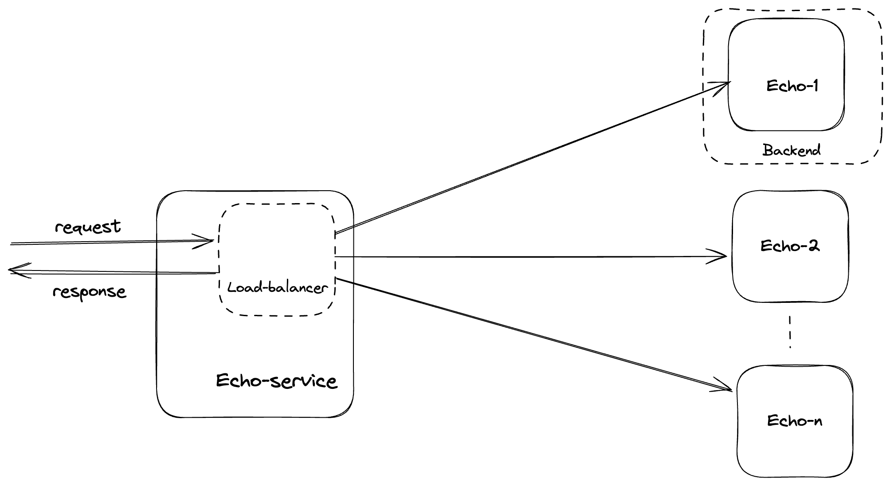

# Round-robin echo server
This application a simple API which distributes incoming request among number of available "echo servers" in round-robin fashion. Both round-robin and echo service is implemented in Go(v1.23).

## Getting started
### Pre-requisites
Following tools should be in your system to run this application.
1. Docker
2. Docker-compose

### How to run
After installing pre-requisites and cloning the repo, simply run `docker-compose up` and you're good to go.
```bash
cd roundrobinecho

docker-compose up -d
```

### How to test
Once docker container are up and running, you can simply make curl (or any http client of your choice) request to the API. The `docker-compose` is setup to expose `http://localhost:6060/echo` to expose the API of concern.
```bash
curl -X POST http://localhost:6060/echo -H 'Content-Type:application/json'  --data '{ "foo":"baar" }'
```
Which should simple echo incoming request as response:
```
{ "foo":"baar" }
```

## Architecture
The load-balancer is the heart of the system which orchestrates the distribution of incoming request amongst available echo services. Lets list out the terminologies used to model the system:
1. <u>Backend</u>: Backend is the external service to cater the incoming request. In this case, Echo APIs are the backends.
2. <u>Load-balancer</u>: Load-balancer holds the logic + mechanism to distribute the work among available Backends. For this demo, `Round-robin` algorithm is used as distribution algorithm, but system has flexibility to extend and support different distributions (like weighted Round-robin, least connection, etc).

----

